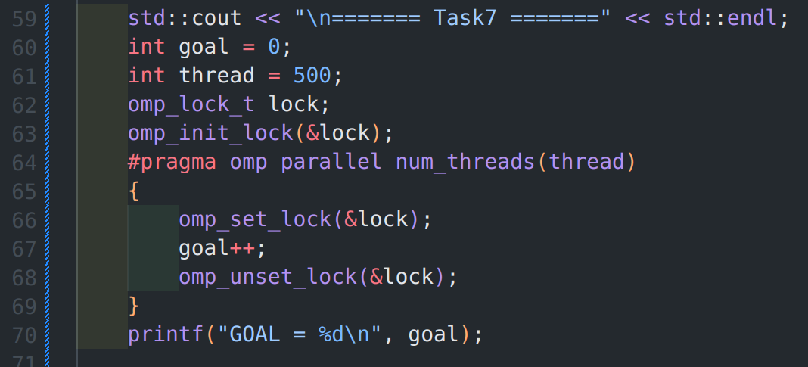
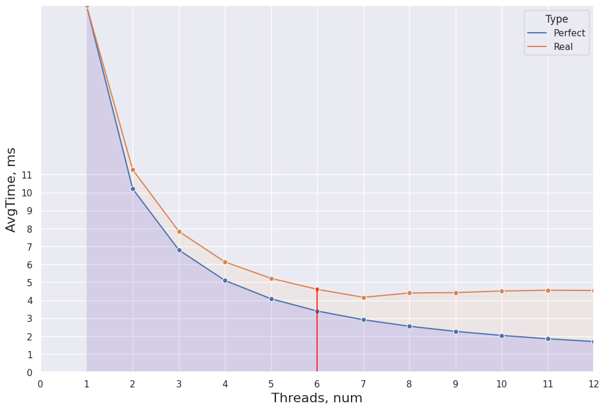
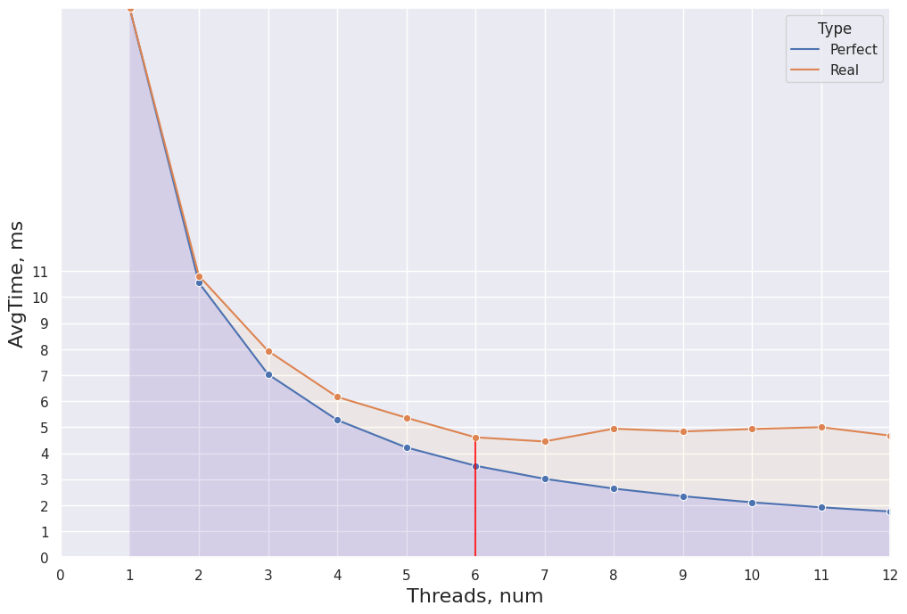
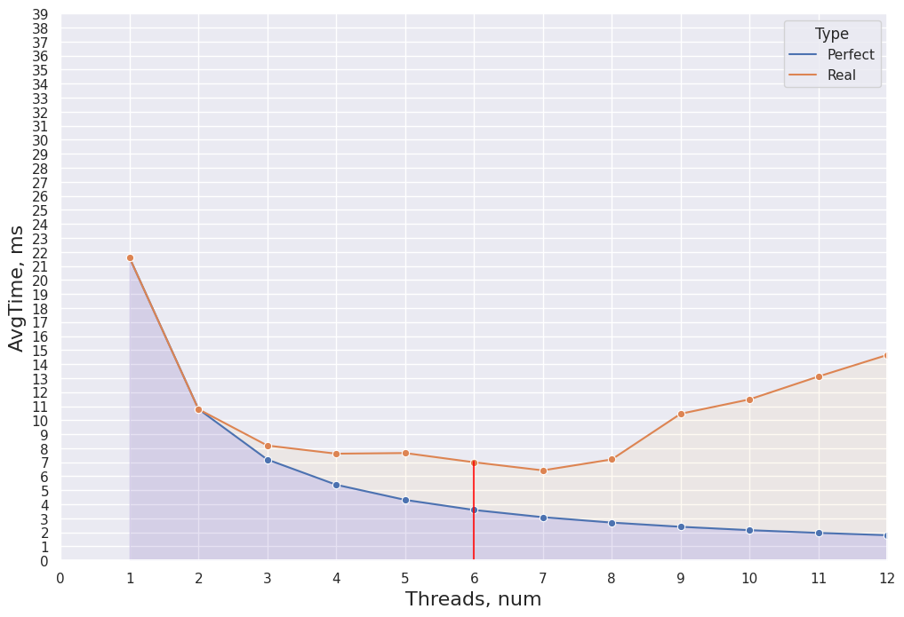
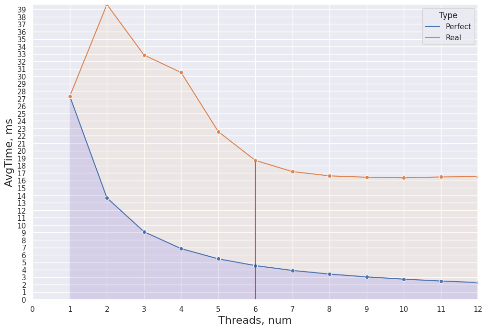
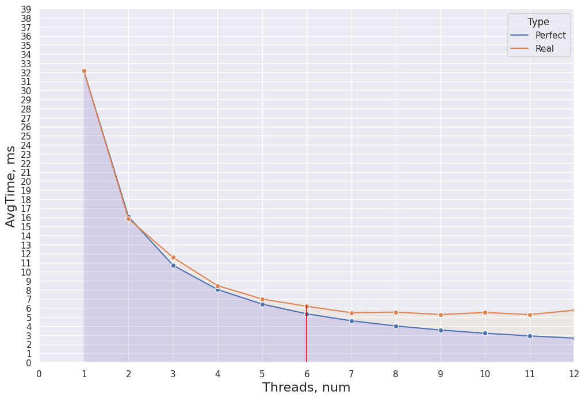

# Лабораторная работа #4, Полищук Максим, Б20-505
## НИЯУ МИФИ

## Ход работы

1. Определить дату принятия используемого стандарта OpenMP

``` bash
echo |cpp -fopenmp -dM |grep -i open
#define _OPENMP 201511, OpenMP version 4.5
```

2. **Количество процессоров** = 6, **количество ядер** = 6 (т.к. используется VirtualBox, которому выделены только 6 реальных ядер процессора)

3. **Dynamic** - параметр показывает возможно ли динамически, во время исполнения программы настраивать количество потоков в параллельных областях
```bash
omp_get_dynamic() = 0
```

4. **OMP_TICKRATE** - 0.000000001 в миллисекундах.

5. Особенности работы с параллельными областями
```C
NESTED = omp_get_nested(); # = 0
MAX_ACTIVE_LEVES = omp_get_max_active_levels(); # = 1
```
NESTED - определяет включен ли вложенный параллелизм (0 => выключен)
MAX_ACTIVE_LEVES - значение *MAX_ACTIVE_LEVELS*, которая показывает максимальное количество вложенных параллельных областей (= 1)

6. **SCHEDULE**

**omp_get_schedule** возвращает тип используемого schedule (static/dynamic/guided...), и установленный размер блока
```bash
======= Task6 =======
SCHEDULE - 1
schedule=dynamic, chunk_size=1
```

7. Разработан простейший алгоритм с использованием блокировок



В данном алгоритме переменная goal должна увеличиваться на +1 с каждой итерацией. Ожидаемый результат `goal = thread = 500`, что и получается. Если убрать явные блокировки, то результат становиться непостоянным (может получиться 497, 495...) так как несколько потоков одновременно могут пытаться икрементировать переменную.


### Schedule

В началае использовался `размер чанка` 10000
##### Static

##### Dynamic

##### Guided


Потом использовался размер чанка = 10
##### Static

##### Dynamic

##### Guided


### Итог
`Dynamic` - динамическое распределение итераций с фиксированным размером блоков

> Если выделить довольно малый размер чанка, то проявляются артефакты и возможно существенное падение производительности


`Static` - используется в стандартном *for*.

> Необходимо для ограничения выделенных мощностей

`Guided` - схож с dynamic, но размер блока пропорционален количеству не назначенных итераций.

> dynamic, который не страдает от ограничения по размеру чанка